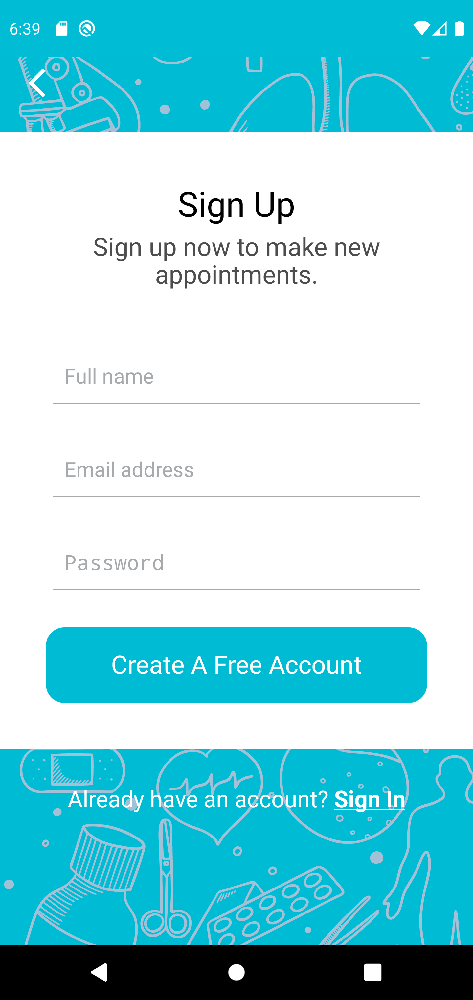

# Health-Q- Doctor appointment app

Health-Q is a demo project based on free [Figma design](https://www.figma.com/file/t9IGYhQmBToThHPtxJUuz5/Doctor-Appointment-App-Community?node-id=0%3A1) with the purpose of a doctor appointment reservation app showcase.

I built it with the mindset of exploring how can I achieve a good project structure while keeping it simple, scalable and production ready.

I started the project with react-native-create boilerplate using the typescript template.

While I am not using an UI library I tried to isolate component development by separating them from any business logic. using storybook during the implementation and writing unit tests with jest library helped a lot.

During the development I wanted to explore different things as well so I used firebase for authentication and firestore as database.

